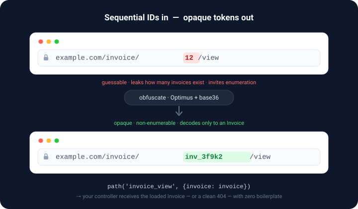

# laulamanapps/tokenable-symfony

Reversible, type-prefixed, **non-enumerable** tokens for your Doctrine entities — so you
never expose `?id=42` in a URL again. A token looks like `per_3f9k2`: a short **type
prefix** plus an obfuscated id.

Internally everything stays a typed integer id; at the HTTP boundary everything is an
opaque, type-tagged, non-guessable token — with **zero per-controller boilerplate**.

<p align="center">
  
</p>

The obfuscation uses [Optimus](https://github.com/jenssegers/optimus) (Knuth multiplicative
hashing) so ids are not sequential or guessable, then base-36 encodes them for compactness.

## Why

Sequential integer ids leak information (record counts, growth rate) and invite enumeration
attacks. This bundle keeps ids private without you having to thread a separate "slug" column
or hand-encode anything.

- **Attribute-driven.** Mark an entity `#[Tokenable(...)]` — that's the whole opt-in.
- **Automatic in URLs.** The router is decorated, so `path('route', {id: entity})` (or an int)
  emits a token. Nothing to remember in templates.
- **Automatic in controllers.** Type-hint the entity in your action and receive the loaded
  object — or a clean 404 for an invalid/unknown/mismatched token.
- **`|token` Twig filter** for the odd manual case.
- **Profiler panel** listing every token in/out of the request, plus config validation
  (duplicate prefixes, colliding triplets, out-of-range primes).

## Requirements

- PHP 8.4+
- Symfony 7.1+ / 8.x
- Doctrine ORM 3+

## Installation

```bash
composer require laulamanapps/tokenable-symfony
```

Register the bundle (Symfony Flex does this automatically):

```php
// config/bundles.php
return [
    // ...
    LauLamanApps\Tokenable\TokenableBundle::class => ['all' => true],
];
```

For the `app:tokenable:generate` helper command, also install phpseclib (dev only):

```bash
composer require --dev phpseclib/phpseclib:^2.0
```

## Configuration

Everything works out of the box; configuration is optional. Defaults shown:

```yaml
# config/packages/tokenable.yaml
tokenable:
    separator: '_'   # placed between the prefix and the obfuscated id — "per_3f9k2"
    base: 36         # radix for the obfuscated id (2-36); 36 gives the shortest tokens
```

`separator` lets you switch to e.g. `-` (giving `per-3f9k2`) if `_` clashes with your routing
or slugs. It may be more than one character. `base` trades token length for the alphabet used
(base 16 → `0-9a-f`, base 36 → `0-9a-z`).

> Changing `separator` or `base` changes every token string, so treat them as set-once for a
> given deployment — existing URLs/bookmarks encoded under the old settings won't decode.

## Usage

### 1. Mark an entity tokenable

Generate a fresh triplet:

```bash
bin/console app:tokenable:generate per
# → #[Tokenable(prefix: 'per', prime: 2062703171, inverse: 392512107, random: 628259887)]
```

Paste it onto the entity:

```php
use LauLamanApps\Tokenable\Attribute\Tokenable;

#[ORM\Entity]
#[Tokenable(prefix: 'per', prime: 2062703171, inverse: 392512107, random: 628259887)]
class Person
{
    public function getId(): PersonId { /* ... */ }
}
```

Each entity gets its **own** triplet so tokens never collide across types. The prefix must be
unique and must not contain the `_` separator. `getId()` may return an `int` or any value
object exposing `getValue(): int`.

### 2. Generate tokens (automatic)

```twig
{# The router decorator encodes the entity/id into a token for you #}
<a href="{{ path('person_show', {person: person}) }}">{{ person.name }}</a>

{# Or explicitly #}
{{ person|token }}   {# per_3f9k2 #}
```

### 3. Resolve tokens (automatic)

```php
#[Route('/people/{person}', name: 'person_show')]
public function __invoke(Person $person): Response
{
    // $person is already loaded from the token in the URL.
}
```

The value resolver runs at priority 200 (before Doctrine's own `EntityValueResolver`). An
invalid token, an unknown prefix, or a prefix that resolves to the wrong entity type all
produce a `404` — unless the argument is nullable, in which case a not-found entity yields
`null`.

### Programmatic access

Inject the `Tokenizer` service anywhere:

```php
use LauLamanApps\Tokenable\Tokenizer;

public function __construct(private readonly Tokenizer $tokenizer) {}

$token       = $this->tokenizer->encode($person);      // 'per_3f9k2'
[$class, $id] = $this->tokenizer->decode('per_3f9k2');  // [Person::class, 42]
```

### Debugging a token from the CLI

`app:tokenable:convert` converts a single identifier when you pass one, or drops into an
interactive REPL when you don't:

```bash
# One-shot: decode a token directly
bin/console app:tokenable:convert per_3f9k2
# → Class: App\...\Person   Id: 42

# Interactive: feed it tokens or integers repeatedly (integers prompt for the class)
bin/console app:tokenable:convert
# Identifier: per_3f9k2   → Class: App\...\Person   Id: 42
# Identifier: 42          → (pick class) → Token: per_3f9k2
```

## Commands

| Command | Purpose |
|---|---|
| `app:tokenable:generate <prefix>` | Generate a fresh prime/inverse/random triplet (needs `phpseclib/phpseclib`) |
| `app:tokenable:convert [token]` | Convert the given token/id directly, or run interactively when omitted |

## How it fits together

| Service | Role |
|---|---|
| `Tokenizer` | Encode/decode; discovers `#[Tokenable]` entities via Doctrine metadata |
| `TokenableValueResolver` | Controller argument → loaded entity |
| `TokenableUrlGenerator` | Router decorator — encodes ids/entities in `path()`/`generateUrl()` |
| `TokenExtension` | The `|token` Twig filter (only registered when Twig is present) |
| `TokenCollector` | Web-profiler panel (only registered when the profiler is enabled) |
| `GenerateTokenableCommand` / `ConvertTokenCommand` | The console commands above |

## Development

```bash
composer install
composer test      # PHPUnit
composer phpstan   # PHPStan (level max)
```

## License

MIT — see [LICENSE](LICENSE).
